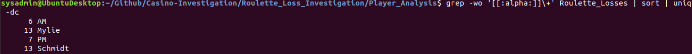
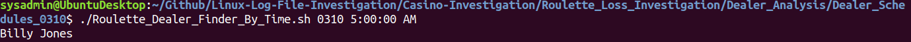

# Linux Casino Log File Investigation

## Scenario: 
 * A casino has lossed signficant amount of money on the roulette tables over the last month  
 * The largest losses occured on March 10, 12, 15  
 * There are suspicions of a conspiring casino dealer and player 
 * Data
     * Wins and losses
     * Player Analysis
     * Dealer Schedules
## Task
  * Navigate, modify, and analyze these data files to gather evidence on the rogue dealer and player duo
  * Prepare evidence files for the prosecution
  * Identify the suspects

## Step 1: Prepare
 * Prepare the file structure for the investigation
## Step 2: Gather the Evidence
 * Download the evidence files using wget
 * Place evidence files in the appropriate file locations
## Step 3: Correlate the Evidence
 * Corrleate large losses from the roulette tables with the dealer schedule
 * Determine which players and dealers were present during the largest losses
 * Process:
     * Consolidate losses into file called "Roulette Losses"
        * command: cat 0310_win_loss_player_data | awk '$3 ~ /-/' >> Roulette_Losses
            * this finds the lines that display negative numbers (losses) from the [March 10 Log File](Casino-Investigation/Roulette_Loss_Investigation/Player_Analysis/Roulette_Player_WinLoss_0310/0310_win_loss_player_data) and copies them to a file named "Roulette Losses"
            *  Repeat for March 12 and 15 to append all losses to [Roulette_Losses](Casino-Investigation/Roulette_Loss_Investigation/Player_Analysis/Roulette_Losses)
    *  Find the player who's name shows up the most during the biggest losses
        *  command: grep -wo '[[:alpha:]]\+' Roulette_Losses | sort | uniq -dc
            *  this will display the words that show up the most along with their wordcounts
            *  result:
            *  
            *   This tells us that Mylie Schmidt was present at the roulette table for each and every significant loss (13 times)
## Step 4: Write a Script to Find a Dealer by Date and Time
  * Click on the file to see what a typical dealer schedule looks like [0310_Dealer_Schedule](Casino-Investigation/Roulette_Loss_Investigation/Dealer_Analysis/Dealer_Schedules_0310/0310_Dealer_schedule)
  * We will use the [Dealer Finder Script](Casino-Investigation/Roulette_Loss_Investigation/Dealer_Analysis/Dealer_Schedules_0310/Roulette_Dealer_Finder_By_Time.sh) to find the dealer working at a specific time and date like so:
  * 

